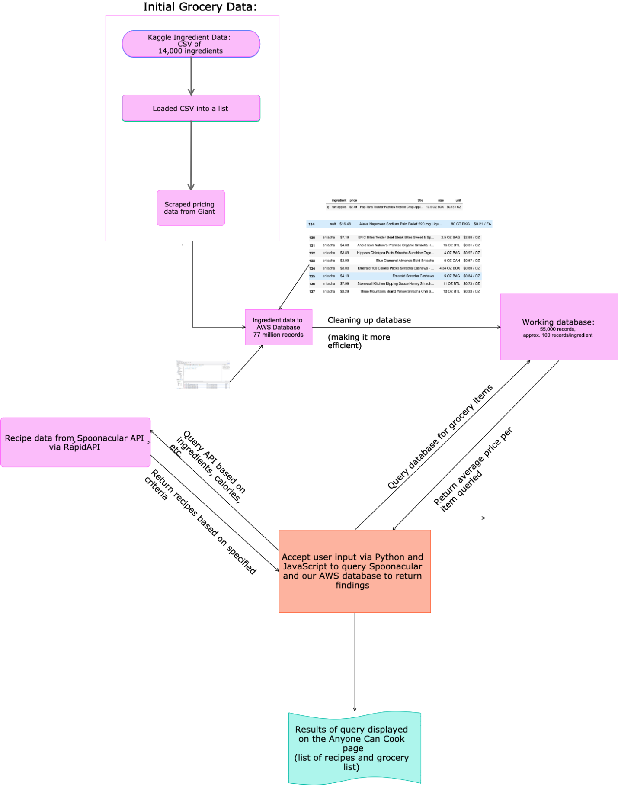

**Anyone-Can-Cook**

Data-driven website enhancing household weekly meal planning, provisioning, and
preparation, with automated recommendations for like recipes and suggested
pantry provisioning

**Live Web Site Link**

The repository does not contain the live website. That website can be reached at
<http://anyone-cancook.herokuapp.com/>.

**Review of My Contribution to Project:**

-   Multi-hour web scrape of Giant Food grocery stores website, returning
    ingredients, quantities, prices, which required allowing adequate time to
    receive data returns. Capture of this data to AWS MySQL database. Data
    engineering to manage database size and complexity and to speed up
    timeliness of database queries against an initially enormous dataset.

-   Logic to query the Spoontacular API, to accept selected recipes, and to
    insert the returns into the week meal planner and then passes those recipe
    IDs to the next page.

-   Logic on the second page that populates the recipe ingredients into the
    selector table (underneath the recipe cards).

-   The further logic (also on the second page) that default selects all the
    recipe ingredients, allows the user to unselect recipe ingredients (already
    in the fridge or pantry), then passes only selected ingredients into a
    single column dataframe that then inner merges with the multi-column
    all-recipe ingredients dataframe (includes brand name, prices,
    quantity/size, et.al.) which is then passed to the final page

-   The logic on the third page that builds the map that starts with all Giant
    Food supermarket street addresses and geocoordinates (based on a second
    Giant Food web scrape and Google Maps API place return), then allows the
    user to enter a zip code and search radius and then dynamically return a new
    map with just nearby Giant Food supermarkets and recentered and zoomed on
    the zip code geocoordinates.

-   Member of the tiger team that debugged all the way through to the Heroku
    deployment.

**Overview Flow Chart**

**Web Site Concept, Design and Development Team Members:**

-   Katherine Kane, [kakane@umich.edu](mailto:kakane@umich.edu)

-   Rebekah Hulsey, <https://www.linkedin.com/in/rebekahehulsey/>

-   Sree Kodali, <https://www.linkedin.com/in/sree-kodali-09a44518a/>

-   Valerie Dandar, <https://www.linkedin.com/in/valerie-dandar-9a29524/>

**Advisors to the Team:**

-   Dartanion Williams, Adjunct Professor, Data Analytics at George Washington
    University, <https://www.linkedin.com/in/dartanion/>

-   Heather Rodney, Technical Assistant,
    <https://www.linkedin.com/in/heatherrodneyms/>

-   Darick Luongo, Technical Assistant, <https://www.linkedin.com/in/daluongo/>
